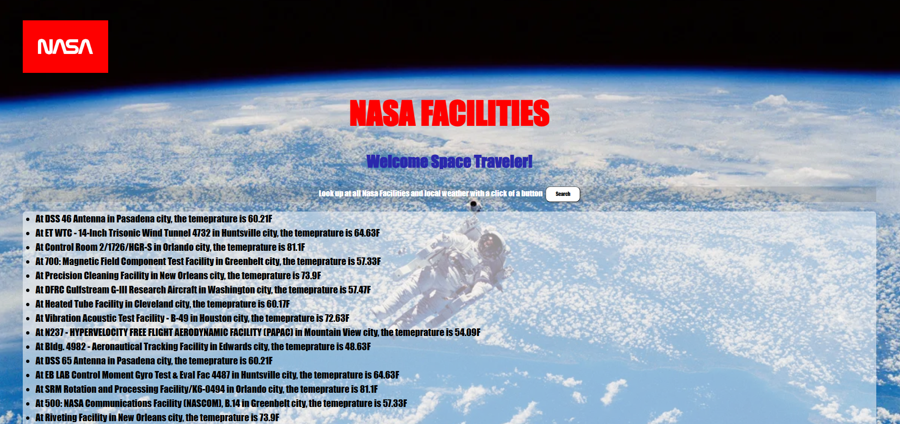

# NASA Facilties Information Center 🚀

# Description
This website enables user to get facility info and local weather data from Nasa and weather APIs

## How It's Made:
Tech used: 
- HTML
- CSS
- JavaScript
- API

## Lessons Learned:
- How to integrate API database into JS

## Notes
- Would like to commit better styling to website

#### API Used
- NASA : https://api.nasa.gov/
- Weather : https://openweathermap.org/api

